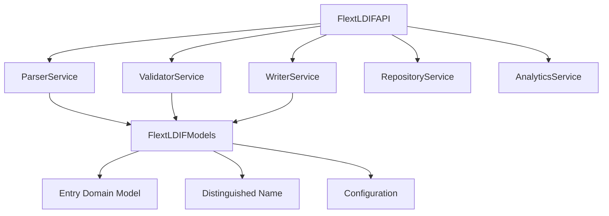

# FLEXT-LDIF

**LDIF processing library** for the FLEXT ecosystem, providing LDAP data parsing and validation using service-oriented architecture and type-safe error handling.

> **STATUS**: Version 0.9.0 - Functional LDIF processing with memory-bound operations

---

## 🎯 Purpose and Role in FLEXT Ecosystem

### **For the FLEXT Ecosystem**

FLEXT-LDIF provides LDIF (LDAP Data Interchange Format) processing capabilities for the FLEXT data integration platform. It handles LDIF file parsing, validation, and basic manipulation operations.

### **Key Responsibilities**

1. **LDIF Processing** - Parse and validate LDIF files with error handling
2. **Type Safety** - Pydantic v2 models for data validation
3. **Service Architecture** - Modular services for parsing, validation, and writing

### **Integration Points**

- **[flext-core](../flext-core/README.md)** → Foundation patterns (FlextResult, FlextContainer)
- **[algar-oud-mig](../algar-oud-mig/README.md)** → Oracle Unified Directory migration project
- **Projects requiring LDIF processing** → Directory data operations

---

## 🏗️ Architecture and Patterns

### **FLEXT-Core Integration Status**

| Pattern             | Status         | Description             |
| ------------------- | -------------- | ----------------------- |
| **FlextResult[T]**  | 🟢 Complete      | Operations return FlextResult for error handling |
| **FlextService**    | 🟢 Complete      | Service-oriented architecture with LDIF services |
| **FlextContainer**  | 🟢 Complete      | Dependency injection for service orchestration |
| **Domain Patterns** | 🟢 Complete      | LDIF Entry, DN, and Attribute domain models |

> **Integration**: Uses flext-core patterns with memory-bound processing

### **Architecture Overview**



---

## 🚀 Quick Start

### **Installation**

```bash
cd flext-ldif
make setup

# Verify installation
python -c "from flext_ldif import FlextLDIFAPI; print('FLEXT-LDIF ready')"
```

### **Basic Usage**

```python
from flext_ldif import FlextLDIFAPI
from pathlib import Path

# Initialize API
api = FlextLDIFAPI()

# Parse LDIF file
result = api.parse_file(Path("directory.ldif"))
if result.is_success:
    entries = result.unwrap()
    print(f"Parsed {len(entries)} LDIF entries")

    # Validate entries
    validation_result = api.validate_entries(entries)
    if validation_result.is_success:
        print("LDIF validation successful")
    else:
        print(f"Validation error: {validation_result.error}")
else:
    print(f"Parse error: {result.error}")
```

---

## 🔧 Development

### **Essential Commands**

```bash
make setup          # Development environment setup
make lint           # Ruff linting
make type-check     # MyPy type checking
make test           # Run test suite
make validate       # Validation pipeline
```

### **Quality Gates**

- **Type Safety**: MyPy strict mode compliance for `src/`
- **Code Quality**: Ruff linting and formatting
- **Testing**: Unit and integration tests
- **LDIF Compliance**: Basic RFC 2849 support

---

## 🧪 Testing

### **Test Structure**

```bash
tests/
├── unit/                    # Service component tests
├── integration/             # End-to-end LDIF processing
├── fixtures/ldif/           # Test LDIF data samples
└── conftest.py             # Shared test configuration
```

### **Testing Commands**

```bash
pytest                                    # Full test suite
pytest -m unit                          # Unit tests only
pytest -m integration                   # Integration tests only
pytest --cov=src/flext_ldif             # Coverage report
```

---

## 📊 Status and Metrics

### **Current Capabilities (v0.9.0)**

- **LDIF Processing**: Basic parsing and validation of LDIF files
- **Service Architecture**: Five services (parser, validator, writer, repository, analytics)
- **Type Safety**: Pydantic v2 models with type annotations
- **Error Handling**: FlextResult patterns for error management
- **Memory-bound Processing**: Loads entire files into memory for processing

### **Known Limitations**

- **Memory Usage**: Loads entire files into memory during processing
- **Performance**: Single-threaded processing suitable for small files
- **Scale**: Recommended for files under 100MB due to memory constraints
- **Features**: Basic functionality with room for enhancement

### **Ecosystem Integration**

- **Primary User**: algar-oud-mig (Oracle migration project)
- **Foundation**: flext-core (base patterns and utilities)
- **Context**: LDAP directory processing within FLEXT ecosystem

---

## 🗺️ Roadmap

### **Current Version (v0.9.0)**

Functional LDIF processing with service-oriented architecture. Suitable for development and small-scale use cases.

### **Planned Improvements**

- **Memory Optimization**: Investigate streaming approaches for large files
- **Performance**: Evaluate processing bottlenecks and optimization opportunities
- **Features**: Additional LDIF operations based on user requirements
- **Testing**: Expand test coverage for edge cases

See TODO.md for detailed development priorities.

---

## 📚 Documentation

- **[Getting Started](docs/getting-started.md)** - Installation and setup
- **[Architecture](docs/architecture.md)** - Service design and patterns
- **[API Reference](docs/api-reference.md)** - Complete API documentation
- **[Configuration](docs/configuration.md)** - Settings and environment management
- **[Development](docs/development.md)** - Contributing and workflows
- **[Integration](docs/integration.md)** - FLEXT ecosystem integration patterns
- **[Examples](docs/examples/)** - Working code examples
- **[Troubleshooting](docs/troubleshooting.md)** - Common issues and solutions

---

## 🤝 Contributing

### **FLEXT-Core Compliance**

- [x] Operations return FlextResult[T] for error handling
- [x] Services use FlextContainer for dependency injection
- [x] Type annotations with Python 3.13+ syntax
- [x] Pydantic v2 models for data validation
- [x] Integration with flext-core patterns

### **Quality Standards**

- **Code Quality**: MyPy strict mode compliance
- **Test Coverage**: Unit and integration tests
- **Documentation**: Public APIs documented
- **Architecture**: Service-oriented design patterns

---

## 📄 License

MIT License - see [LICENSE](LICENSE) for details.

---

## 🆘 Support

- **Documentation**: [docs/](docs/)
- **Issues**: [GitHub Issues](https://github.com/flext-sh/flext-ldif/issues)
- **Security**: Report security issues privately to maintainers

---

**FLEXT-LDIF v0.9.0** - LDIF processing library for LDAP data operations within the FLEXT ecosystem.

**Purpose**: Provide type-safe LDIF processing capabilities for FLEXT projects requiring directory data handling.