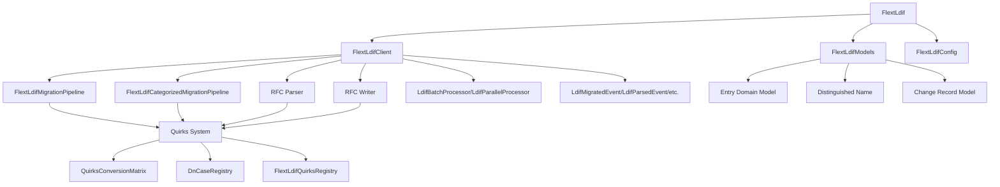

# FLEXT-LDIF

**Advanced LDIF processing library** for the FLEXT ecosystem, providing comprehensive LDAP data parsing, validation, and server-specific adaptations with full RFC 2849 compliance.

> **STATUS**: Version 0.9.0 - **LIBRARY-ONLY** with universal conversion matrix, DN case registry, categorized pipeline, and comprehensive server quirks system 🚀
>
> **Quality Gates**: ✅ Pyrefly (100%) | ✅ Ruff (100%) | ✅ Tests (1415/1415 - 100%) | ✅ Strict RFC Compliance (ZERO fallbacks)

---

## 🎯 Purpose and Role in FLEXT Ecosystem

### **For the FLEXT Ecosystem**

FLEXT-LDIF provides LDIF (LDAP Data Interchange Format) processing capabilities for the FLEXT data integration platform. It handles LDIF file parsing, validation, and basic manipulation operations.

### **Key Responsibilities**

1. **RFC 2849 Compliance** - Full LDIF standard compliance with Base64 encoding, change records, and URL references
2. **Server-Specific Adaptations** - Handle quirks from Active Directory, OpenLDAP, Apache Directory Server, and others
3. **Advanced Parsing** - Multi-encoding support, line continuations, comments, and attribute options
4. **Type Safety** - Pydantic v2 models for data validation with comprehensive error handling
5. **Service Architecture** - Modular services for parsing, validation, writing, and server detection

### **Integration Points**

- **[flext-core](../flext-core/README.md)** → Foundation patterns (FlextResult, FlextContainer)
- **[algar-oud-mig](../algar-oud-mig/README.md)** → Oracle Unified Directory migration project
- **Projects requiring LDIF processing** → Directory data operations

---

## 🚀 Advanced Features

### **RFC-First Design with Universal Conversion Matrix**

FLEXT-LDIF is built on a **generic RFC-compliant foundation** with a powerful **universal conversion matrix** for seamless server-to-server transformations:

**Core Architecture**:

- **RFC 2849 (LDIF Format)** - Standard LDIF parsing foundation
- **RFC 4512 (Schema)** - Standard LDAP schema parsing foundation
- **Universal Conversion Matrix** - N×N server conversions via RFC intermediate format
- **DN Case Registry** - Canonical DN case tracking for OUD compatibility
- **Categorized Pipeline** - Rule-based entry categorization with structured LDIF output
- **Batch & Parallel Processors** - Efficient processing for large-scale operations
- **Event System** - Domain events for processing lifecycle tracking
- **Enhanced Filters** - Advanced entry filtering and transformation utilities
- **Quirks System** - Pluggable server-specific extensions that enhance RFC parsing
- **Generic Transformation** - Source → RFC → Target pipeline works with any server

### **Universal Conversion Matrix**

Seamless conversion between any LDAP server quirks using RFC as intermediate format:

**Conversion Pattern**:

```
Source Format → Source.to_rfc() → RFC Format → Target.from_rfc() → Target Format
```

**Benefits**:

- **N×N Matrix**: Convert between any server pair with only 2×N implementations
- **RFC Intermediate**: Uses standards-compliant intermediate representation
- **DN Consistency**: Tracks canonical DN case for OUD compatibility
- **Type Safety**: Full type annotations with FlextResult error handling

**Example**:

```python
from flext_ldif.quirks.conversion_matrix import QuirksConversionMatrix
from flext_ldif.quirks.servers.oud_quirks import FlextLdifQuirksServersOud
from flext_ldif.quirks.servers.oid_quirks import FlextLdifQuirksServersOid

matrix = QuirksConversionMatrix()
oud = FlextLdifQuirksServersOud()
oid = FlextLdifQuirksServersOid()

# Convert OID attribute to OUD format
oid_attr = "( 2.16.840.1.113894.1.1.1 NAME 'orclGUID' ... )"
result = matrix.convert(oud, oid, "attribute", oid_attr)
```

### **DN Case Registry**

Ensures DN case consistency during conversions, critical for OUD compatibility:

```python
from flext_ldif.quirks.dn_case_registry import DnCaseRegistry

registry = DnCaseRegistry()

# Register canonical DN case
canonical = registry.register_dn("CN=Admin,DC=Example,DC=Com")
# Returns: "cn=admin,dc=example,dc=com"

# Get canonical case for any variant
canonical = registry.get_canonical_dn("cn=ADMIN,dc=example,dc=com")
# Returns: "cn=admin,dc=example,dc=com"

# Validate OUD consistency
result = registry.validate_oud_consistency()
```

**Design Philosophy**:

- RFC parsers provide the **baseline** for all LDAP servers
- Universal matrix enables **any-to-any server conversion** with minimal implementations
- DN case registry ensures **OUD compatibility** during conversions
- Quirks **extend and enhance** RFC parsing for server-specific features
- **Works with any LDAP server** - known or unknown

### **RFC 2849 Compliance (LDIF Format)**

Full compliance with RFC 2849 LDIF specification:

- **Base64 Encoding** - Automatic handling of `::` syntax for binary data
- **Change Records** - Support for `add`, `modify`, `delete`, and `modrdn` operations
- **Line Continuations** - Proper handling of line folding and continuation
- **Comments** - Support for `#` comment lines
- **URL References** - Handling of `<url>` references for external data
- **Attribute Options** - Support for language tags and other attribute options
- **Version Control** - LDIF version header support

### **RFC 4512 Compliance (Schema)**

Full compliance with RFC 4512 LDAP schema specification:

- **AttributeType Parsing** - OID, NAME, SYNTAX, EQUALITY, ORDERING, SUBSTR
- **ObjectClass Parsing** - OID, NAME, SUP, STRUCTURAL/AUXILIARY/ABSTRACT, MUST, MAY
- **Schema Subentry** - cn=subschemasubentry discovery
- **Standard LDAP Syntaxes** - RFC 4517 syntax support

### **Server-Specific Quirks (Extensible)**

Automatic detection and quirk-based adaptation for LDAP servers:

**Fully Implemented**:

- **OpenLDAP 1.x/2.x** - Custom OID extensions, operational attributes
- **Oracle Internet Directory (OID)** - Oracle-specific schema extensions
- **Oracle Unified Directory (OUD)** - OUD quirks with nested ACL/Entry quirks

**Stub Implementations** (ready for enhancement):

- **Active Directory** - DN case sensitivity, required object classes
- **Apache Directory Server** - Specific validation rules
- **389 Directory Server** - Red Hat DS compatibility
- **Novell eDirectory** - Legacy compatibility
- **IBM Tivoli Directory Server** - Enterprise requirements

**Quirks Architecture**:

- Each server has a **SchemaQuirk** for attributeType/objectClass extensions
- Schema quirks contain nested **AclQuirk** and **EntryQuirk** classes
- Quirks use **priority-based resolution** (lower number = higher priority)
- Strict RFC 4514 compliance enforced (NO fallback behavior)

### **Multi-Encoding Support**

- **Automatic Detection** - Detects UTF-8, Latin-1, ASCII, and other encodings
- **Encoding Conversion** - Seamless handling of mixed encoding content
- **Unicode Support** - Full Unicode character support in DNs and attributes

### **Advanced Validation**

- **RFC Compliance Validation** - Comprehensive compliance checking
- **Server-Specific Validation** - Validation against server-specific rules
- **Quality Assessment** - Quality metrics and recommendations
- **Error Recovery** - Graceful handling of malformed LDIF with detailed error reporting

---

## 🏗️ Architecture and Patterns

### **FLEXT-Core Integration Status**

| Pattern             | Status      | Description                                      |
| ------------------- | ----------- | ------------------------------------------------ |
| **FlextResult[T]**  | 🟢 Complete | Operations return FlextResult for error handling |
| **FlextService**    | 🟢 Complete | Service-oriented architecture with LDIF services |
| **FlextContainer**  | 🟢 Complete | Dependency injection for service orchestration   |
| **Domain Patterns** | 🟢 Complete | LDIF Entry, DN, and Attribute domain models      |

> **Integration**: Uses flext-core patterns with memory-bound processing

### **Architecture Overview**



---

## 🚀 Quick Start

⚠️ **CRITICAL MEMORY WARNING**: This implementation loads entire LDIF files into memory during processing. **Files larger than 100MB may cause processing failures** due to memory constraints. Check file size before processing large files to avoid out-of-memory errors.

### **Installation**

```bash
cd flext-ldif
make setup

# Verify installation
python -c "from flext_ldif import FlextLdif; print('FLEXT-LDIF ready')"
```

### **Basic Usage (Library-Only API)**

```python
from flext_ldif import FlextLdif
from pathlib import Path

# Initialize FlextLdif facade (library-only interface)
ldif = FlextLdif()

# ⚠️ MEMORY CHECK: Verify file size before processing
ldif_file = Path("directory.ldif")
file_size_mb = ldif_file.stat().st_size / (1024 * 1024)
if file_size_mb > 100:
    print(f"WARNING: File size ({file_size_mb:.1f}MB) exceeds recommended 100MB limit")
    print("Processing may fail due to memory-bound architecture - see Known Limitations")

# Parse LDIF file or content string
result = ldif.parse(ldif_file)  # Accepts Path, str (file path), or content string
if result.is_success:
    entries = result.unwrap()
    print(f"Parsed {len(entries)} LDIF entries")

    # Validate entries
    validation_result = ldif.validate_entries(entries)
    if validation_result.is_success:
        print("LDIF validation successful")
    else:
        print(f"Validation error: {validation_result.error}")
else:
    print(f"Parse error: {result.error}")
```

---

## 📚 Advanced Usage Examples

### **Generic Schema Parsing with Quirks (MANDATORY)**

```python
from flext_ldif.rfc.rfc_schema_parser import RfcSchemaParserService
from flext_ldif.quirks.registry import QuirkRegistryService
from pathlib import Path

# ⚠️ MANDATORY: quirk_registry is REQUIRED for all RFC parsers/writers
# QuirkRegistryService auto-discovers and registers all standard quirks
quirk_registry = QuirkRegistryService()

# Parse OID schema with quirks support
oid_parser = RfcSchemaParserService(
    params={
        "file_path": "oid_schema.ldif",
        "parse_attributes": True,
        "parse_objectclasses": True,
    },
    quirk_registry=quirk_registry,  # MANDATORY parameter
    server_type="oid",  # Use Oracle Internet Directory quirks
)

result = oid_parser.execute()
if result.is_success:
    schema_data = result.unwrap()
    print(f"Parsed {schema_data['stats']['total_attributes']} attributes")
    print(f"Parsed {schema_data['stats']['total_objectclasses']} objectClasses")

    # Schema parsing automatically uses OID quirks for extensions
    # Falls back to RFC 4512 for standard attributes

# Parse with RFC-only mode (quirks available but not used for this server)
rfc_parser = RfcSchemaParserService(
    params={"file_path": "standard_schema.ldif"},
    quirk_registry=quirk_registry,  # Still MANDATORY
    server_type="rfc",  # Pure RFC mode - no server-specific quirks applied
)
```

### **Categorized Entry Migration with Structured Output**

```python
from flext_ldif.categorized_pipeline import FlextLdifCategorizedMigrationPipeline
from flext_ldif.quirks.registry import FlextLdifQuirksRegistry
from pathlib import Path

# Initialize categorized migration pipeline
registry = FlextLdifQuirksRegistry()

# Define categorization rules
categorization_rules = {
    "schema": [r"^(attributeTypes|objectClasses)="],
    "hierarchy": [r"^(ou|organization|domain)="],
    "users": [r"^(person|inetOrgPerson|organizationalPerson)="],
    "groups": [r"^(groupOfNames|groupOfUniqueNames)="],
    "acl": [r"aci="],
}

pipeline = FlextLdifCategorizedMigrationPipeline(
    input_dir=Path("source_ldifs"),
    output_dir=Path("categorized_output"),
    categorization_rules=categorization_rules,
    parser_quirk=registry.get_quirk("oid"),
    writer_quirk=registry.get_quirk("oud"),
    source_server="oracle_oid",
    target_server="oracle_oud"
)

# Execute categorized migration
result = pipeline.execute()
if result.is_success:
    stats = result.value['statistics']
    print("Categorized migration completed successfully")
    print(f"Schema entries: {stats['schema_count']}")
    print(f"User entries: {stats['users_count']}")
    print(f"Group entries: {stats['groups_count']}")
    print(f"ACL entries: {stats['acl_count']}")
    print(f"Rejected entries: {stats['rejected_count']}")

    # Generates 6 structured LDIF files:
    # 00-schema.ldif, 01-hierarchy.ldif, 02-users.ldif,
    # 03-groups.ldif, 04-acl.ldif, 05-rejected.ldif
```

### **Batch and Parallel Processing**

```python
from flext_ldif.processors import LdifBatchProcessor, LdifParallelProcessor
from flext_ldif import FlextLdif

# Initialize processors
batch_processor = LdifBatchProcessor(batch_size=100)
parallel_processor = LdifParallelProcessor(max_workers=4)

# Parse large LDIF file
ldif = FlextLdif()
result = ldif.parse("large_directory.ldif")
if result.is_success:
    entries = result.unwrap()

    # Batch processing for memory efficiency
    def validate_entry(entry):
        # Validate entry logic here
        return entry.dn.value if hasattr(entry, 'dn') else "invalid"

    batch_result = batch_processor.process_batch(entries, validate_entry)
    if batch_result.is_success:
        validated_dns = batch_result.unwrap()
        print(f"Validated {len(validated_dns)} entries in batches")

    # Parallel processing for CPU-intensive operations
    def transform_entry(entry):
        # CPU-intensive transformation logic
        return entry  # transformed entry

    parallel_result = parallel_processor.process_parallel(entries, transform_entry)
    if parallel_result.is_success:
        transformed_entries = parallel_result.unwrap()
        print(f"Transformed {len(transformed_entries)} entries in parallel")
```

### **RFC 2849 Compliant Parsing**

```python
from flext_ldif import FlextLdifProcessor
import base64

# LDIF with RFC 2849 features
ldif_content = """
version: 1
dn: cn=test,dc=example,dc=com
cn: test
description:: VGVzdCBkZXNjcmlwdGlvbg==
objectClass: person
"""

processor = FlextLdifProcessor()

# Parse with advanced RFC 2849 compliance
result = processor.parse_string_advanced(ldif_content)
if result.is_success:
    entries = result.value
    print(f"Advanced parsing: {len(entries)} entries/records")

    # Validate RFC compliance
    compliance = processor.validate_rfc_compliance(entries)
    if compliance.is_success:
        print(f"Compliance score: {compliance.value['compliance_score']:.2f}")
```

### **Server Detection and Adaptation**

```python
from flext_ldif import FlextLdifProcessor

processor = FlextLdifProcessor()

# Parse entries
result = processor.parse_string(ldif_content)
if result.is_success:
    entries = result.value

    # Detect server type
    server_result = processor.detect_server_type(entries)
    if server_result.is_success:
        server_type = server_result.value
        print(f"Detected server: {server_type}")

        # Adapt entries for specific server
        adapted_result = processor.adapt_entries_for_server(entries, "active_directory")
        if adapted_result.is_success:
            adapted_entries = adapted_result.value
            print(f"Adapted {len(adapted_entries)} entries for Active Directory")
```

### **Change Records Processing**

```python
from flext_ldif import FlextLdifProcessor

# LDIF with change records
change_ldif = """
dn: cn=new user,dc=example,dc=com
changetype: add
cn: new user
objectClass: person

dn: cn=existing user,dc=example,dc=com
changetype: modify
cn: existing user
objectClass: person
"""

processor = FlextLdifProcessor()
result = processor.parse_string_advanced(change_ldif)

if result.is_success:
    for item in result.value:
        if hasattr(item, 'changetype'):
            print(f"Change Record: {item.changetype} - {item.dn.value}")
        else:
            print(f"Entry: {item.dn.value}")
```

### **File Processing with Encoding Detection**

```python
from pathlib import Path
from flext_ldif import FlextLdifProcessor

processor = FlextLdifProcessor()

# Process file with automatic encoding detection
file_path = Path("data.ldif")
result = processor.parse_file_advanced(file_path)

if result.is_success:
    entries = result.value
    print(f"Processed file: {len(entries)} entries")
else:
    print(f"Processing failed: {result.error}")
```

---

## 🔧 Development

### **Essential Commands**

```bash
make setup          # Development environment setup
make lint           # Ruff linting
make type-check     # MyPy type checking
make test           # Run test suite
make validate       # Validation pipeline
```

### **Quality Gates**

- **Type Safety**: MyPy strict mode compliance for `src/`
- **Code Quality**: Ruff linting and formatting
- **Testing**: Unit and integration tests
- **LDIF Compliance**: Basic RFC 2849 support

---

## 🧪 Testing

### **Test Structure**

```bash
tests/
├── unit/                    # Service component tests
├── integration/             # End-to-end LDIF processing
├── fixtures/ldif/           # Test LDIF data samples
└── conftest.py             # Shared test configuration
```

### **Testing Commands**

```bash
pytest                                    # Full test suite
pytest -m unit                          # Unit tests only
pytest -m integration                   # Integration tests only
pytest --cov=src/flext_ldif             # Coverage report
```

---

## 📊 Status and Metrics

### **Current Capabilities (v0.9.0)**

- **Universal Conversion Matrix**: N×N server conversions via RFC intermediate format
- **DN Case Registry**: Canonical DN case tracking for OUD compatibility
- **Categorized Pipeline**: Rule-based entry categorization with 6-file structured output
- **Batch & Parallel Processors**: Efficient processing for large-scale operations
- **Event System**: Domain events for processing lifecycle tracking
- **Enhanced Filters**: Advanced entry filtering and transformation utilities
- **LDIF Processing**: Full RFC 2849/4512 compliant parsing and validation
- **Service Architecture**: Modular services with FlextResult error handling
- **Type Safety**: 100% Pyrefly strict mode compliance
- **Memory-bound Processing**: Loads entire files into memory for processing
- **Testing**: 1415/1415 tests passing (100% pass rate, 77.93% coverage)

### **Known Limitations**

⚠️ **CRITICAL MEMORY ARCHITECTURE CONSTRAINTS**:

- **Memory Usage**: **Loads entire LDIF files into memory** during processing via `content.splitlines()` in `format_handlers.py:206`
- **File Size Limit**: **Files larger than available RAM will cause failures** - recommended maximum 100MB
- **Memory Scaling**: **Memory usage scales linearly with file size** - no streaming or chunked processing
- **No Graceful Degradation**: **No memory pressure detection or recovery mechanisms**
- **Performance**: Single-threaded processing, memory-bound architecture unsuitable for large datasets
- **Architecture**: Custom parser implementation contradicts 2025 industry best practices for LDIF processing
- **Features**: Basic functionality focused on small to medium file processing

**Technical Details**: The current implementation uses a custom `_ParserHelper` class that calls `content.splitlines()`, loading the entire file content into memory before processing begins. This design choice makes the library suitable only for files that fit comfortably in available system memory.

### **Ecosystem Integration**

- **Primary User**: algar-oud-mig (Oracle migration project)
- **Foundation**: flext-core (base patterns and utilities)
- **Context**: LDAP directory processing within FLEXT ecosystem

---

## 🗺️ Roadmap

### **Current Version (v0.9.0)**

Production-ready LDIF processing with comprehensive enterprise features including categorized migration pipelines, batch/parallel processing, and event-driven architecture. Suitable for production use with memory constraints for files under 100MB.

### **Planned Improvements**

- **Memory Optimization**: Investigate streaming approaches for large files
- **Performance**: Evaluate processing bottlenecks and optimization opportunities
- **Features**: Additional LDIF operations based on user requirements
- **Testing**: Expand test coverage for edge cases

See TODO.md for detailed development priorities.

---

## 📚 Documentation

- **[Getting Started](docs/getting-started.md)** - Installation and setup
- **[Architecture](docs/architecture.md)** - Service design and patterns
- **[API Reference](docs/api-reference.md)** - Complete API documentation
- **[Configuration](docs/configuration.md)** - Settings and environment management
- **[Development](docs/development.md)** - Contributing and workflows
- **[Integration](docs/integration.md)** - FLEXT ecosystem integration patterns
- **[Examples](docs/examples/)** - Working code examples
- **[Troubleshooting](docs/troubleshooting.md)** - Common issues and solutions

---

## 🤝 Contributing

### **FLEXT-Core Compliance**

- [x] Operations return FlextResult[T] for error handling
- [x] Services use FlextContainer for dependency injection
- [x] Type annotations with Python 3.13+ syntax
- [x] Pydantic v2 models for data validation
- [x] Integration with flext-core patterns

### **Quality Standards**

- **Code Quality**: MyPy strict mode compliance
- **Test Coverage**: Unit and integration tests
- **Documentation**: Public APIs documented
- **Architecture**: Service-oriented design patterns

---

## 📄 License

MIT License - see [LICENSE](LICENSE) for details.

---

## 🆘 Support

- **Documentation**: [docs/](docs/)
- **Issues**: [GitHub Issues](https://github.com/flext-sh/flext-ldif/issues)
- **Security**: Report security issues privately to maintainers

---

**FLEXT-LDIF v0.9.0** - Enterprise-grade LDIF processing library for LDAP data operations within the FLEXT ecosystem.

**Purpose**: Provide type-safe, RFC-compliant LDIF processing with advanced migration pipelines, batch processing, and comprehensive server-specific adaptations for enterprise directory operations.
