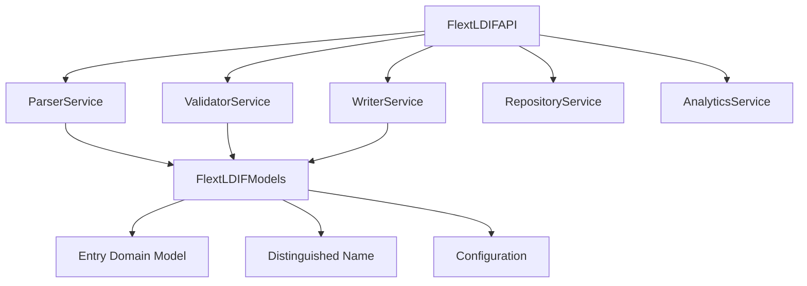

# FLEXT-LDIF

[](https://www.python.org/downloads/)
[](https://github.com/flext-sh/flext-ldif)

**RFC 2849 compliant LDIF processing library** for the FLEXT ecosystem, providing LDAP data parsing and generation with **railway-oriented programming** and **service-oriented architecture**.

> **⚠️ STATUS**: Version 0.9.0 - Functional LDIF processing with memory-bound operations for files <100MB

---

## 🎯 Purpose and Role in FLEXT Ecosystem

### **For the FLEXT Ecosystem**

FLEXT-LDIF provides LDIF (LDAP Data Interchange Format) processing capabilities across the FLEXT data integration platform, enabling LDAP migrations, directory synchronization, and user management operations.

### **Key Responsibilities**

1. **LDIF Processing** - RFC 2849 compliant parsing, validation, and generation with error handling
2. **Data Integration** - Bridge between LDAP directories and FLEXT data pipelines
3. **Directory Migration** - Support for directory migration projects

### **Integration Points**

- **[flext-core](../flext-core/README.md)** → Foundation patterns (FlextResult, FlextContainer)
- **[algar-oud-mig](../algar-oud-mig/README.md)** → Oracle Unified Directory migration project
- **[flext-api](../flext-api/README.md)** → REST endpoints for LDIF processing operations
- **All 33 FLEXT Projects** → LDIF processing when working with directory data

---

## 🏗️ Architecture and Patterns

### **FLEXT-Core Integration Status**

| Pattern             | Status         | Description             |
| ------------------- | -------------- | ----------------------- |
| **FlextResult[T]**  | 🟢 Implemented   | Operations return FlextResult for error handling |
| **FlextService**    | 🟢 Implemented   | Service-oriented architecture with LDIF services |
| **FlextContainer**  | 🟢 Implemented   | Dependency injection for service orchestration |
| **Domain Patterns** | 🟢 Implemented   | LDIF Entry, DN, and Attribute domain models |

> **Status**: 🟢 Service-oriented architecture for files <100MB

### **Architecture Overview**



---

## 🚀 Quick Start

### **Installation**

```bash
git clone https://github.com/flext-sh/flext-ldif.git
cd flext-ldif
make setup

# Verify installation
python -c "from flext_ldif import FlextLDIFAPI; print('FLEXT-LDIF ready')"
```

### **Basic Usage**

```python
from flext_ldif import FlextLDIFAPI
from pathlib import Path

# Initialize API with FLEXT patterns
api = FlextLDIFAPI()

# Parse LDIF using railway-oriented programming
result = api.parse_file(Path("directory.ldif"))
if result.is_success:
    entries = result.unwrap()
    print(f"Parsed {len(entries)} LDIF entries")

    # Chain operations with FlextResult
    validation_result = api.validate_entries(entries)
    if validation_result.is_success:
        # Filter and analyze entries
        persons_result = api.filter_persons(entries)
        stats_result = api.get_entry_statistics(entries)

        print(f"Found {len(persons_result.unwrap())} person entries")
else:
    print(f"Parse error: {result.error}")
```

---

## 🔧 Development

### **Essential Commands**

```bash
make setup          # Development environment setup
make lint           # Ruff linting
make type-check     # MyPy type checking
make test           # Run test suite
make validate       # Validation pipeline
```

### **Quality Gates**

- **Source Quality**: Zero errors in MyPy strict mode for `src/`
- **Type Safety**: Type annotations with Pydantic v2 validation
- **LDIF Compliance**: RFC 2849 standard validation
- **Service Architecture**: Separation between parsing, validation, writing

---

## 🧪 Testing

### **Test Structure**

```bash
tests/
├── unit/                    # Service component tests
├── integration/             # End-to-end LDIF processing
├── fixtures/ldif/           # Test LDIF data samples
└── conftest.py             # Shared test configuration
```

### **Testing Commands**

```bash
pytest                                    # Full test suite
pytest -m unit                          # Unit tests only
pytest -m integration                   # Integration tests only
pytest --cov=src/flext_ldif             # Coverage report
```

---

## 📊 Status and Metrics

### **Current Capabilities (v0.9.0)**

- **LDIF Processing**: RFC 2849 compliant parsing and writing with validation
- **Service Architecture**: Five services (parser, validator, writer, repository, analytics) with unified API
- **Type Safety**: Pydantic v2 models with type annotations
- **Error Handling**: Railway-oriented programming with FlextResult patterns
- **Memory-bound Performance**: Processing for files <100MB (loads entire file into memory)

### **Known Limitations**

- **Memory Usage**: Uses `LDIFRecordList` approach which loads entire files into memory
- **Performance**: Single-threaded processing without streaming (similar to `python-ldap` standard approach)
- **Scale**: Suitable for small-to-medium LDIF files (recommended <100MB based on `LDIFRecordList` limitations)
- **Features**: Basic functionality, streaming architecture planned

### **Ecosystem Integration**

- **Direct Dependencies**: algar-oud-mig (Oracle migration project)
- **Service Dependencies**: flext-core (foundation patterns)
- **Integration Points**: LDAP directory processing across FLEXT platform

---

## 🗺️ Roadmap

### **Current Version (v0.9.0)**

Functional LDIF processing with service-oriented architecture and FLEXT integration patterns. Suitable for development and small-scale production use.

### **Future Development**

Based on 2025 LDIF processing research:
- **Streaming Architecture**: Memory-efficient processing using line-by-line parsing (addressing current `LDIFRecordList` memory limitations)
- **Chunk-based Processing**: Configurable chunk sizes for large file handling (>100MB)
- **Memory Profiling**: Integration with `psutil` and `memory_profiler` for performance optimization
- **Custom Parser**: Override of default `ldif.LDIFParser` to avoid loading entire files into memory

See project TODO.md for development roadmap.

---

## 📚 Documentation

- **[Getting Started](docs/getting-started.md)** - Installation and setup
- **[Architecture](docs/architecture.md)** - Service design and patterns
- **[API Reference](docs/api-reference.md)** - Complete API documentation
- **[Configuration](docs/configuration.md)** - Settings and environment management
- **[Development](docs/development.md)** - Contributing and workflows
- **[Integration](docs/integration.md)** - FLEXT ecosystem integration patterns
- **[Examples](docs/examples/)** - Working code examples
- **[Troubleshooting](docs/troubleshooting.md)** - Common issues and solutions

---

## 🤝 Contributing

### **FLEXT-Core Compliance Checklist**

- [ ] All operations return FlextResult[T] for error handling
- [ ] Services use FlextContainer for dependency injection
- [ ] Type annotations with Python 3.13+ syntax
- [ ] Pydantic v2 models for data validation
- [ ] Integration with flext-core logging patterns

### **Quality Standards**

- **Code Quality**: Zero MyPy errors in strict mode
- **Test Coverage**: Unit and integration tests
- **Documentation**: All public APIs documented with examples
- **Architecture**: Follow service-oriented and domain-driven patterns

---

## 📄 License

MIT License - see [LICENSE](LICENSE) for details.

---

## 🆘 Support

- **Documentation**: [docs/](docs/)
- **Issues**: [GitHub Issues](https://github.com/flext-sh/flext-ldif/issues)
- **Security**: Report security issues privately to maintainers

---

**FLEXT-LDIF v0.9.0** - LDIF processing foundation enabling LDAP data integration across the FLEXT ecosystem.

**Mission**: Provide reliable, type-safe LDIF processing capabilities that integrate with FLEXT data integration workflows while maintaining RFC 2849 compliance and software quality standards.