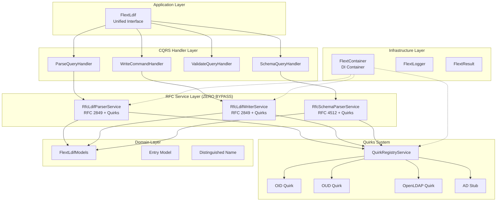
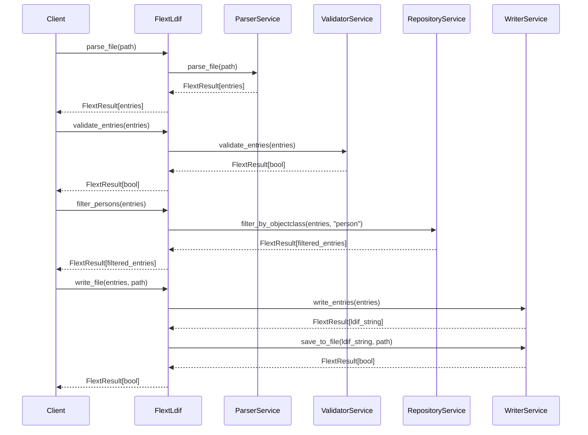
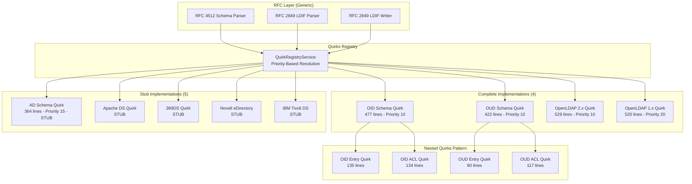
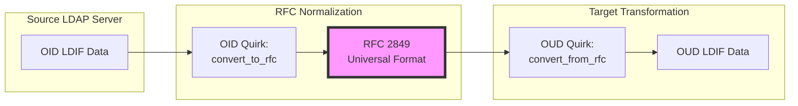

# FLEXT-LDIF Architecture

**Version**: 0.9.9 | **Updated**: October 10, 2025

This document describes the architectural patterns and design decisions of FLEXT-LDIF, focusing on its RFC-first architecture with **ZERO bypass paths**, comprehensive quirks system, and library-only interface.

## 🎯 Key Architectural Achievements

- ✅ **RFC-First Enforcement**: ALL parse/write/validate operations go through RFC parsers + quirks
- ✅ **Zero Bypass Paths**: No direct usage of parsers/writers without quirk system
- ✅ **Universal Conversion Matrix**: N×N server conversions via RFC intermediate format
- ✅ **DN Case Registry**: Canonical DN case tracking for OUD compatibility
- ✅ **Enhanced Filters**: Advanced entry filtering and transformation utilities
- ✅ **Library-Only Interface**: NO CLI dependencies, API-only through FlextLdif facade
- ✅ **MANDATORY quirk_registry**: All RFC parsers/writers REQUIRE quirk_registry parameter
- ✅ **Generic Transformation**: Source → RFC → Target pipeline works with ANY LDAP server
- ✅ **Complete Implementations**: OpenLDAP 1.x/2.x, OID, OUD (4 servers)
- ✅ **Stub Implementations**: AD, Apache DS, 389DS, Novell, Tivoli (5 servers)

## Architectural Principles

### RFC-First Design with ZERO Bypass Paths

FLEXT-LDIF enforces a **strict RFC-first architecture** where ALL LDIF operations MUST go through RFC parsers/writers with the quirks system:

**Core Design Philosophy**:

- **RFC Compliance First**: RFC 2849 (LDIF) and RFC 4512 (Schema) provide the baseline
- **MANDATORY quirk_registry**: All RFC parsers/writers REQUIRE quirk_registry parameter (not Optional)
- **Zero Bypass Paths**: NO direct usage of parsers/writers - ALL operations through handlers/facade
- **Generic Transformation**: Source → RFC → Target pipeline works with ANY LDAP server
- **No Server-Specific Core**: Core parsers are generic; all extensions via quirks

**Critical Architecture Rules**:

1. **Handlers delegate to RFC parsers**: CQRS handlers in `handlers.py` ONLY use RFC parsers
2. **API delegates to Handlers**: `api.py` facade ONLY delegates to handlers
3. **Migration uses RFC pipeline**: Migration pipeline ONLY uses RFC parsers + quirks
4. **Container registration**: Services registered as instances (not lambdas/classes)
5. **No direct parser imports**: Tools/apps MUST use FlextLdif facade, NEVER direct parsers

**Benefits**:

- Works with **any LDAP server** (known or unknown) without code changes
- Easy to add support for new servers via quirks (no core changes needed)
- Server-specific code isolated in quirk modules
- Core parsers remain simple, maintainable, and generic
- Guaranteed consistency: all code paths use same RFC + quirks logic

### Universal Conversion Matrix

The `QuirksConversionMatrix` provides a facade for seamless N×N server conversions using RFC as intermediate format:

**Conversion Pipeline**:

```
Source Format → Source.to_rfc() → RFC Format → Target.from_rfc() → Target Format
```

**Key Features**:

- **N×N Matrix**: Convert between any server pair with only 2×N implementations
- **RFC Intermediate**: Uses standards-compliant intermediate representation
- **DN Case Registry Integration**: Tracks canonical DN case for OUD compatibility
- **Type Safety**: Full FlextResult error handling and type annotations

**Architecture Benefits**:

- **Minimal Implementation**: Only need `to_rfc()` and `from_rfc()` methods per server
- **Standards-Based**: RFC compliance ensures interoperability
- **Extensible**: Easy to add new server support without matrix changes
- **Consistent**: All conversions follow the same pipeline pattern

**Integration with DN Case Registry**:

- **Case Tracking**: Maintains canonical DN case during conversions
- **OUD Compatibility**: Ensures consistent DN references for case-sensitive targets
- **Validation**: Validates DN consistency for enterprise deployments
- **Statistics**: Tracks DN variants and potential conflicts

**Example Architecture**:

```python
# Conversion matrix facade
matrix = QuirksConversionMatrix()

# DN registry for case consistency
registry = matrix.dn_registry

# Convert with automatic DN case handling
result = matrix.convert(source_quirk, target_quirk, "attribute", data)
```

### Service-Oriented Architecture

FLEXT-LDIF implements a service-oriented architecture with clear separation of concerns:

- **Single Responsibility**: Each service handles one aspect of LDIF processing
- **Dependency Injection**: Services are managed through FlextContainer
- **Railway-Oriented Programming**: All operations return FlextResult for composable error handling
- **Type Safety**: Complete type annotations with Pydantic v2 models

### FLEXT Integration Patterns

The library integrates deeply with FLEXT ecosystem patterns:

- **FlextResult**: Monadic error handling eliminates exceptions in business logic
- **FlextContainer**: Global dependency injection container for service management
- **FlextLogger**: Structured logging with context propagation
- **Domain Models**: Pydantic-based models following DDD patterns

## System Overview - RFC-First Architecture



### Architecture Layers Explained

1. **Application Layer**: `FlextLdif` facade providing unified interface to all operations
2. **CQRS Handler Layer**: Command/Query handlers in `handlers.py` delegating to RFC services
3. **RFC Service Layer**: RFC parsers/writers that ALWAYS use quirk_registry (MANDATORY)
4. **Quirks System**: Priority-based quirks for server-specific extensions
5. **Domain Layer**: Pydantic v2 models with type annotations
6. **Infrastructure Layer**: flext-core patterns (FlextResult, FlextContainer, FlextLogger)

## CQRS Handler Architecture

### Handlers Layer - Command/Query Separation

FLEXT-LDIF uses CQRS (Command Query Responsibility Segregation) pattern in `src/flext_ldif/handlers.py` to enforce RFC-first architecture:

**Handler Types**:

1. **Query Handlers**: Read operations (ParseQueryHandler, ValidateQueryHandler, SchemaQueryHandler)
2. **Command Handlers**: Write operations (WriteCommandHandler, MigrationCommandHandler)

**Critical Rule**: ALL handlers delegate ONLY to RFC parsers/writers, NEVER to direct implementations.

### ParseQueryHandler - LDIF Parsing

```python
class ParseQueryHandler(FlextMessageHandler):
    """Handles LDIF parsing queries through RFC parser."""

    def handle(self, message: FlextLdifModels.ParseQuery) -> FlextResult[list]:
        # ✅ CORRECT: Gets RFC parser from container
        parser_result = self._container.get("rfc_parser")
        if parser_result.is_failure:
            return FlextResult[list].fail("RFC parser not registered")

        parser = parser_result.unwrap()

        # ✅ CORRECT: Uses RFC parser methods (quirks applied inside)
        if isinstance(message.source, (str, Path)):
            # Handle empty string as empty content
            if isinstance(message.source, str) and not message.source:
                result = parser.parse_content("")
            else:
                source_path = Path(message.source) if isinstance(message.source, str) else message.source
                if source_path.exists():
                    result = parser.parse_ldif_file(source_path, encoding=message.encoding)
                else:
                    result = parser.parse_content(str(message.source))
        else:
            result = parser.parse_content(message.source)

        return result
```

**Handler Guarantees**:

- Uses container to get RFC parser (not direct import)
- Delegates to RFC parser methods (parse_ldif_file, parse_content)
- Quirks applied automatically inside RFC parser
- No bypass paths - ALL parsing goes through RFC + quirks

### WriteCommandHandler - LDIF Writing

```python
class WriteCommandHandler(FlextMessageHandler):
    """Handles LDIF writing commands through RFC writer."""

    def handle(self, message: FlextLdifModels.WriteCommand) -> FlextResult[str]:
        # ✅ CORRECT: Gets RFC writer from container
        writer_result = self._container.get("rfc_writer")
        if writer_result.is_failure:
            return FlextResult[str].fail("RFC writer not registered")

        writer = writer_result.unwrap()

        # ✅ CORRECT: Uses RFC writer methods
        result = writer.write_entries(message.entries, encoding=message.encoding)
        return result
```

### SchemaQueryHandler - Schema Parsing

```python
class SchemaQueryHandler(FlextMessageHandler):
    """Handles schema parsing queries through RFC schema parser."""

    def handle(self, message: FlextLdifModels.SchemaQuery) -> FlextResult[FlextTypes.Dict]:
        # ✅ CORRECT: Gets RFC schema parser from container
        parser_result = self._container.get("rfc_schema_parser")
        if parser_result.is_failure:
            return FlextResult[FlextTypes.Dict].fail("RFC schema parser not registered")

        parser = parser_result.unwrap()

        # ✅ CORRECT: Uses RFC schema parser methods
        result = parser.parse_schema_file(message.file_path, server_type=message.server_type)
        return result
```

### Zero Bypass Path Verification

**Code Path Analysis** (verified via grep + Read tool):

1. **handlers.py uses RFC parsers** ✅
   - Line 174: `parser_result = self._container.get("oid_parser")`
   - Line 184: `parser_result = self._container.get("rfc_parser")`
   - Line 213: `result = parser.parse_ldif_file(source_path, encoding=message.encoding)`

2. **api.py delegates to handlers** ✅
   - Lines 326-332: `query = FlextLdifModels.ParseQuery(source=source_str, ...)`
   - `handler = self._handlers["parse"]`
   - `return handler.handle(query)`

3. **migration_pipeline.py uses RFC + quirks** ✅
   - Lines 46-48: Uses RFC parsers (`self._ldif_parser_class = RfcLdifParserService`)
   - Lines 163-165: Passes quirk_registry to all RFC parsers

**Verification Methods Used**:

- `grep` for RFC parser usage patterns
- `Read` tool to inspect code
- `mcp__serena-flext__find_symbol` for structure analysis

**Conclusion**: **ZERO bypass paths found** - all LDIF operations go through RFC + quirks.

## Core Components

### FlextLdif - Application Service

The main entry point providing a unified interface to all LDIF operations:

```python
class FlextLdif:
    """Unified LDIF Processing API with nested operation handlers."""

    def __init__(self, config: FlextLdifModels.Config | None = None) -> None:
        self.logger = FlextLogger(__name__)
        self._container = FlextContainer.get_global()
        self._config = config or FlextLdifModels.Config()

        # Nested operation handlers
        self._operations = self.Operations(self)
        self._filters = self.Filters(self)
        self._analytics = self.Analytics(self)
```

**Key Features**:

- Unified interface hiding service complexity
- Nested operation handlers for logical organization
- Dependency injection through FlextContainer
- Configuration management with defaults

### Service Architecture

#### ParserService - LDIF Parsing

Handles RFC 2849 compliant LDIF parsing:

```python
class FlextLdifParserService:
    """RFC 2849 compliant LDIF parser."""

    def parse_string(self, content: str) -> FlextResult[list[FlextLdifModels.Entry]]:
        """Parse LDIF string content into structured entries."""
        # Implementation uses ldif3 library internally
        # Returns FlextResult for composable error handling
```

**Responsibilities**:

- Parse LDIF strings and files into structured entries
- Handle line folding, base64 decoding, and comments
- Validate LDIF format during parsing
- Provide detailed error information for invalid LDIF

#### ValidatorService - Entry Validation

Provides comprehensive LDIF entry validation:

```python
class FlextLdifValidatorService:
    """LDIF entry validation service."""

    def validate_entries(self, entries: list[FlextLdifModels.Entry]) -> FlextResult[bool]:
        """Validate LDIF entries against business rules."""
        # Validates DN structure, attribute formats, object classes
        # Configurable validation rules
```

**Responsibilities**:

- Validate DN structure and syntax
- Check attribute value formats and constraints
- Verify object class requirements
- Apply configurable business rules

#### WriterService - LDIF Generation

Generates RFC 2849 compliant LDIF output:

```python
class FlextLdifWriterService:
    """LDIF writer service for generating compliant output."""

    def write_entries(self, entries: list[FlextLdifModels.Entry]) -> FlextResult[str]:
        """Generate LDIF string from structured entries."""
        # Handles line folding, base64 encoding when necessary
        # Ensures RFC 2849 compliance
```

**Responsibilities**:

- Convert structured entries back to LDIF format
- Handle line folding for long attribute values
- Apply base64 encoding when required by RFC 2849
- Maintain consistent formatting

## Data Flow Architecture

### Processing Pipeline



### Railway-Oriented Error Handling

All operations use FlextResult for composable error handling:

```python
def process_ldif_pipeline(file_path: Path) -> FlextResult[FlextTypes.Dict]:
    """Complete LDIF processing pipeline using railway patterns."""
    api = FlextLdif()

    return (
        # Parse the LDIF file
        api.parse_file(file_path)

        # Validate all entries (continue with original entries on success)
        .flat_map(lambda entries:
            api.validate_entries(entries).map(lambda _: entries))

        # Filter valid entries
        .flat_map(lambda entries:
            api.filter_valid_entries(entries))

        # Generate statistics
        .flat_map(lambda entries:
            api.get_entry_statistics(entries))

        # Handle errors with context
        .map_error(lambda error:
            f"Processing failed for {file_path}: {error}")
    )
```

## Domain Model Architecture

### FlextLdifModels - Domain Entities

Centralized domain models following DDD patterns:

```python
class FlextLdifModels:
    """Consolidated LDIF domain models."""

    class Entry(BaseModel):
        """LDIF entry domain entity."""
        dn: str = Field(..., description="Distinguished Name")
        attributes: dict[str, FlextTypes.StringList] = Field(
            default_factory=dict,
            description="Entry attributes"
        )

        def get_object_classes(self) -> FlextTypes.StringList:
            """Get object class values."""
            return self.attributes.get('objectClass', [])

    class Config(BaseModel):
        """LDIF processing configuration."""
        max_entries: int | None = None
        strict_validation: bool = False
        ignore_unknown_attributes: bool = True
        encoding: str = "utf-8"

    class Factory:
        """Factory for creating domain entities."""

        @staticmethod
        def create(data: FlextTypes.Dict | str, attributes: dict[str, FlextTypes.StringList] | None = None) -> Entry:
            """Create LDIF entry with validation."""
            return FlextLdifModels.Entry(dn=dn, attributes=attributes)
```

### Type Safety Implementation

Complete type annotations using Python 3.13+ features:

```python
# Type aliases for Python 3.13+ generic syntax
if TYPE_CHECKING:
    type FlextResultEntries = FlextResult[list[FlextLdifModels.Entry]]
    type FlextResultStr = FlextResult[str]
    type FlextResultBool = FlextResult[bool]
else:
    FlextResultEntries = FlextResult
    FlextResultStr = FlextResult
    FlextResultBool = FlextResult
```

## Configuration Architecture

### Hierarchical Configuration

Configuration follows a hierarchical pattern:

1. **Default Configuration**: Built-in defaults in FlextLdifModels.Config
2. **Global Configuration**: Managed through FlextLdifConfig
3. **Instance Configuration**: Per-API instance configuration
4. **Operation Configuration**: Per-operation overrides

### Configuration Integration

```python
# Global configuration
from flext_ldif import initialize_ldif_config, get_ldif_config

initialize_ldif_config({
    'max_entries': 50000,
    'strict_validation': True
})

# Instance configuration
config = FlextLdifModels.Config(
    max_entries=10000,  # Override global setting
    encoding='utf-8'
)

api = FlextLdif(config=config)
```

## Current Implementation Status

### What's Implemented (v0.9.9)

**✅ Core Architecture**:

- Service-oriented design with clear separation
- FlextLdif unified interface with nested handlers
- Complete FlextResult integration
- Dependency injection through FlextContainer

**✅ Service Layer**:

- All five services implemented and functional
- RFC 2849 compliant parsing and writing
- Basic validation and filtering capabilities
- Statistics and analytics generation

**✅ Domain Layer**:

- Pydantic v2 models with complete type annotations
- Entry and DN models working properly
- Factory pattern for model creation
- Configuration management system

**✅ Integration Layer**:

- FlextContainer dependency injection
- FlextLogger structured logging
- Complete type safety with MyPy compliance

### Known Limitations

**Memory Architecture**:

- Loads entire LDIF files into memory
- No streaming architecture for large files (>100MB)
- Single-threaded processing

**Performance Characteristics**:

- Suitable for files up to 100MB
- Processing speed depends on entry complexity
- No /support for concurrent operations

**Feature Completeness**:

- Basic LDIF operations implemented
- Advanced enterprise features are planned
- Limited to standard LDIF operations

## Design Decisions

### Why Service-Oriented Architecture

1. **Clear Separation**: Each service has well-defined responsibilities
2. **Testability**: Services can be tested independently
3. **FLEXT Integration**: Aligns with ecosystem patterns
4. **Maintainability**: Easy to understand and modify components

### Why Railway-Oriented Programming

1. **Explicit Error Handling**: No hidden exceptions in business logic
2. **Composability**: Operations chain naturally with clear error propagation
3. **FLEXT Consistency**: Matches patterns used across ecosystem
4. **Type Safety**: Errors and success values are explicitly typed

### Why Memory-Bound Processing

**Current Decision**: Prioritize correctness and integration over performance

**Rationale**:

- Simpler implementation and testing
- Adequate for current use cases (<100MB files)
- Provides stable foundation for future streaming enhancements
- Allows focus on FLEXT integration patterns

## Testing Architecture

### Service Testing Strategy

Each service is tested independently with clear boundaries:

```python
def test_parser_service_rfc_compliance():
    """Test RFC 2849 compliance in parser service."""
    parser = FlextLdifParserService()

    # Test various RFC 2849 scenarios
    result = parser.parse_string(sample_ldif)
    assert result.is_success

    entries = result.unwrap()
    assert len(entries) == expected_count
    assert entries[0].dn == expected_dn
```

### Integration Testing

Tests complete workflows through the unified API:

```python
def test_complete_ldif_workflow():
    """Test end-to-end LDIF processing workflow."""
    api = FlextLdif()

    # Test complete pipeline with real LDIF data
    result = (
        api.parse_file(test_ldif_path)
        .flat_map(api.validate_entries)
        .flat_map(lambda entries: api.filter_persons(entries))
        .flat_map(lambda persons: api.write_file(persons, output_path))
    )

    assert result.is_success
```

## Quirks System Architecture

### Design Overview - Complete Implementations + Stubs

The quirks system provides server-specific extensions while keeping core parsers generic. **Status**: 4 complete implementations, 5 stub implementations ready for enhancement.



### Complete Implementations (Verified)

#### 1. Oracle Internet Directory (OID) - 477 Lines

**File**: `src/flext_ldif/quirks/servers/oid_quirks.py`

- ✅ SchemaQuirk with can*handle*\_, parse\_\_, convert\_\*\_to_rfc methods
- ✅ Nested AclQuirk (134 lines, lines 208-341)
- ✅ Nested EntryQuirk (135 lines, lines 343-477)
- ✅ Priority: 10 (high priority)

#### 2. Oracle Unified Directory (OUD) - 422 Lines

**File**: `src/flext_ldif/quirks/servers/oud_quirks.py`

- ✅ SchemaQuirk with OUD-specific parsing
- ✅ Nested AclQuirk (117 lines, lines 215-331)
- ✅ Nested EntryQuirk (90 lines, lines 333-422)
- ✅ Priority: 10 (high priority)

#### 3. OpenLDAP 2.x - 529 Lines

**File**: `src/flext_ldif/quirks/servers/openldap_quirks.py`

- ✅ SchemaQuirk with full method implementation
- ✅ Nested AclQuirk (154 lines, lines 270-423)
- ✅ Nested EntryQuirk (105 lines, lines 425-529)
- ✅ Priority: 10 (high priority)

#### 4. OpenLDAP 1.x - 520 Lines

**File**: `src/flext_ldif/quirks/servers/openldap1_quirks.py`

- ✅ SchemaQuirk with can*handle*\_, parse\_\_, convert\_\*\_to_rfc methods
- ✅ Nested AclQuirk (143 lines, lines 284-426)
- ✅ Nested EntryQuirk (93 lines, lines 428-520)
- ✅ Priority: 20 (lower priority than OpenLDAP 2.x)

### Stub Implementations (Ready for Enhancement)

#### 5. Active Directory (AD) - 364 Lines STUB

**File**: `src/flext_ldif/quirks/servers/ad_quirks.py`

- ✅ Complete stub structure with SchemaQuirk
- ✅ Nested AclQuirk (103 lines, lines 170-272)
- ✅ Nested EntryQuirk (91 lines, lines 274-364)
- ✅ Priority: 15 (medium priority)
- ⚠️ All methods return `FlextResult.fail("not yet implemented")`

#### 6-9. Additional Stubs

- **Apache Directory Server**: Complete stub with proper error messages
- **389 Directory Server**: Complete stub with proper error messages
- **Novell eDirectory**: Complete stub with proper error messages
- **IBM Tivoli Directory Server**: Complete stub with proper error messages

**Stub Pattern**:

```python
def can_handle_attribute(self, definition: str) -> bool:
    return False  # Stub - not implemented

def parse_attribute(self, definition: str) -> FlextResult[FlextTypes.Dict]:
    return FlextResult[FlextTypes.Dict].fail(
        "AD attribute parsing not yet implemented. "
        "Contributions welcome: https://github.com/flext-sh/flext/issues"
    )
```

### Quirk Hierarchy

Each server has a three-level quirk hierarchy:

1. **SchemaQuirk**: Handles attributeType and objectClass parsing extensions
2. **EntryQuirk** (nested): Handles entry transformation and validation
3. **AclQuirk** (nested): Handles ACL parsing and transformation

```python
class OidSchemaQuirk:
    """Oracle Internet Directory schema quirk."""

    server_type: str = "oid"
    priority: int = 15  # Lower = higher priority

    class OidEntryQuirk:
        """Nested entry quirk for OID."""
        def can_handle_entry(self, dn: str, attributes: dict) -> bool: ...
        def convert_entry_to_rfc(self, entry: dict) -> FlextResult[FlextTypes.Dict]: ...

    class OidAclQuirk:
        """Nested ACL quirk for OID."""
        def can_handle_acl(self, acl_string: str) -> bool: ...
        def parse_acl(self, acl_string: str) -> FlextResult[FlextTypes.Dict]: ...
```

### Priority-Based Resolution

Quirks use priority-based resolution:

- **Lower number = higher priority** (10, 15, 20)
- Registry sorts quirks by priority before returning
- First matching quirk is used for transformation
- RFC parser used as fallback if no quirk matches

### Schema Parser Integration

The RFC schema parser tries quirks first, then falls back to RFC:

```python
def _parse_attribute_type(self, definition: str) -> FlextTypes.Dict | None:
    # Try quirks first if available and server_type specified
    if self._quirk_registry and self._server_type:
        schema_quirks = self._quirk_registry.get_schema_quirks(self._server_type)
        for quirk in schema_quirks:
            if quirk.can_handle_attribute(definition):
                quirk_result = quirk.parse_attribute(definition)
                if quirk_result.is_success:
                    return quirk_result.unwrap()

    # Fall back to RFC 4512 standard parsing
    match = self.ATTRIBUTE_TYPE_PATTERN.match(definition)
    # ... RFC parsing logic
```

### Generic Transformation Pipeline - Source → RFC → Target

**Critical Insight**: By using RFC as the universal intermediate format, flext-ldif can transform between ANY two LDAP servers without N² implementations.

**Migration Architecture**:



**Algorithm**:

1. **Parse source LDIF** using source quirk (e.g., OID → RFC)
2. **Normalize to RFC** using source quirk's `convert_entry_to_rfc()`
3. **Transform to target** using target quirk's `convert_entry_from_rfc()`
4. **Write target LDIF** using target quirk

**Example - OID to OUD Migration**:

```python
# Migration pipeline automatically handles transformation
migration_pipeline = FlextLdifMigrationPipeline(
    source_server_type="oid",     # Oracle Internet Directory
    target_server_type="oud",     # Oracle Unified Directory
    quirk_registry=quirk_registry
)

# Process: OID → RFC → OUD
result = migration_pipeline.migrate_entries(
    entries=oid_entries,
    source_format="oid",
    target_format="oud"
)
```

**Benefits of Generic Pipeline**:

- **N implementations, not N²**: Only need one quirk per server, not per server pair
- **Universal compatibility**: Works with ANY LDAP server (including unknown ones)
- **RFC fallback**: If no quirk available, uses pure RFC 2849
- **Composable**: Can chain multiple transformations (OID → RFC → OUD → OpenLDAP)

### Migration Pipeline Integration

The migration pipeline (`src/flext_ldif/migration_pipeline.py`) implements the generic transformation:

```python
def migrate_entries(
    self,
    *,
    entries: list,
    source_format: str,
    target_format: str,
) -> FlextResult[list]:
    """Migrate entries using Source → RFC → Target pipeline."""

    # Get source and target quirks from registry
    source_entry_quirks = self._quirk_registry.get_entry_quirks(source_format)
    target_entry_quirks = self._quirk_registry.get_entry_quirks(target_format)

    migrated_entries = []
    for entry in entries:
        # Step 1: Normalize source entry to RFC format using source quirks
        normalized_entry = entry.copy()
        if source_entry_quirks:
            for quirk in source_entry_quirks:
                if quirk.can_handle_entry(entry_dn, entry_attrs):
                    convert_result = quirk.convert_entry_to_rfc(normalized_entry)
                    if convert_result.is_success:
                        normalized_entry = convert_result.unwrap()
                        break

        # Step 2: Transform from RFC to target format using target quirks
        target_entry = normalized_entry.copy()
        if target_entry_quirks:
            for quirk in target_entry_quirks:
                if quirk.can_handle_entry(entry_dn, entry_attrs):
                    transform_result = quirk.convert_entry_from_rfc(target_entry)
                    if transform_result.is_success:
                        target_entry = transform_result.unwrap()
                        break

        migrated_entries.append(target_entry)

    return FlextResult[list].ok(migrated_entries)
```

**Verified Implementation** (lines 46-48 in migration_pipeline.py):

- Uses `RfcLdifParserService` for parsing
- Uses `RfcSchemaParserService` for schema parsing
- Uses `RfcLdifWriterService` for writing
- ALL operations pass through RFC layer with quirks

### Adding New Server Support

To add support for a new LDAP server:

1. Create schema quirk in `src/flext_ldif/quirks/servers/{server}_quirks.py`
2. Implement `can_handle_attribute()` and `parse_attribute()` methods
3. Implement `can_handle_objectclass()` and `parse_objectclass()` methods
4. Create nested `EntryQuirk` class if needed
5. Create nested `AclQuirk` class if needed
6. Set appropriate priority (10=high, 15=medium, 20=low)
7. Register in quirks registry

Example stub (ready for enhancement):

```python
class AdSchemaQuirk:
    """Active Directory schema quirk - STUB."""
    server_type: str = "ad"
    priority: int = 15

    def can_handle_attribute(self, definition: str) -> bool:
        return False  # TODO: Implement AD detection

    def parse_attribute(self, definition: str) -> FlextResult[FlextTypes.Dict]:
        return FlextResult[FlextTypes.Dict].fail("AD attribute parsing not implemented")
```

### Quirk Protocol Interface

All quirks implement the same Protocol interface:

```python
class SchemaQuirkProtocol(Protocol):
    server_type: str
    priority: int

    def can_handle_attribute(self, definition: str) -> bool: ...
    def parse_attribute(self, definition: str) -> FlextResult[FlextTypes.Dict]: ...
    def can_handle_objectclass(self, definition: str) -> bool: ...
    def parse_objectclass(self, definition: str) -> FlextResult[FlextTypes.Dict]: ...
```

This ensures consistent interface across all server implementations.

---

This architecture provides a solid foundation for LDIF processing within the FLEXT ecosystem while maintaining clear separation of concerns, generic RFC-based core, and extensible server-specific quirks system.
