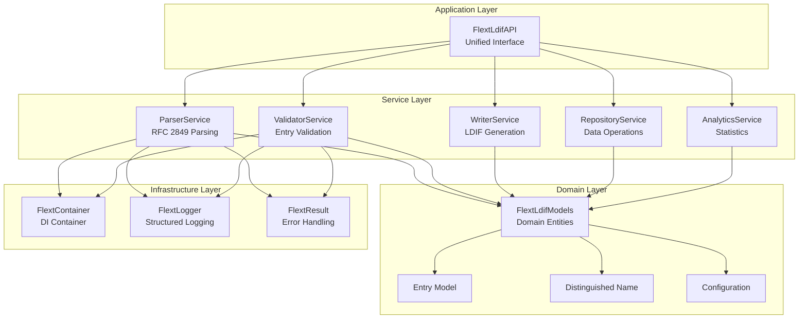
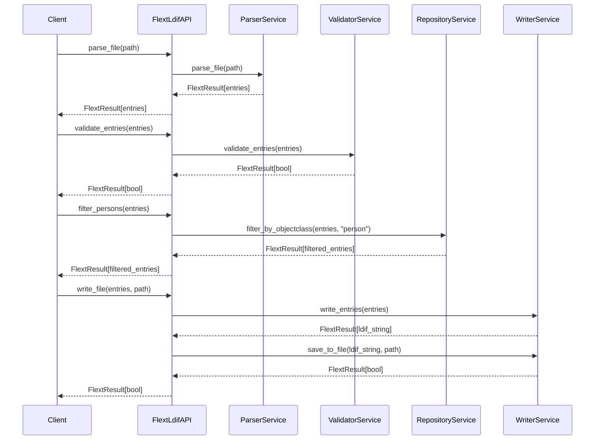
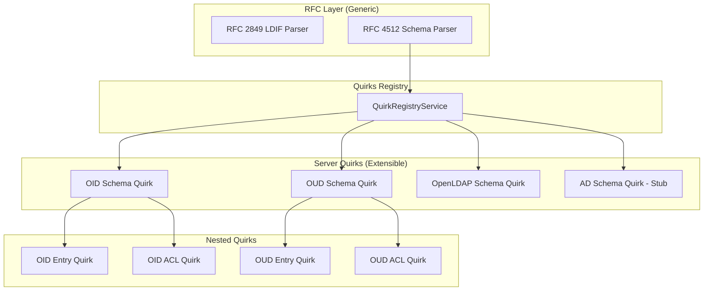

# FLEXT-LDIF Architecture

**Version**: 0.9.9 RC | **Updated**: September 17, 2025

This document describes the architectural patterns and design decisions of FLEXT-LDIF, focusing on its service-oriented architecture and integration with FLEXT ecosystem patterns.

## Architectural Principles

### RFC-First Design with Extensible Quirks

FLEXT-LDIF is built on a **generic RFC-compliant foundation** with a **pluggable quirks system** for server-specific extensions:

**Core Design Philosophy**:
- **RFC Compliance First**: RFC 2849 (LDIF) and RFC 4512 (Schema) provide the baseline
- **Quirks for Extensions**: Server-specific behavior implemented as pluggable quirks
- **Generic Transformation**: Source → RFC → Target pipeline works with any server
- **No Server-Specific Core**: Core parsers are generic; all extensions via quirks

**Benefits**:
- Works with **any LDAP server** (known or unknown)
- Easy to add support for new servers via quirks
- Server-specific code isolated in quirk modules
- Core parsers remain simple and maintainable

### Service-Oriented Architecture

FLEXT-LDIF implements a service-oriented architecture with clear separation of concerns:

- **Single Responsibility**: Each service handles one aspect of LDIF processing
- **Dependency Injection**: Services are managed through FlextContainer
- **Railway-Oriented Programming**: All operations return FlextResult for composable error handling
- **Type Safety**: Complete type annotations with Pydantic v2 models

### FLEXT Integration Patterns

The library integrates deeply with FLEXT ecosystem patterns:

- **FlextResult**: Monadic error handling eliminates exceptions in business logic
- **FlextContainer**: Global dependency injection container for service management
- **FlextLogger**: Structured logging with context propagation
- **Domain Models**: Pydantic-based models following DDD patterns

## System Overview



## Core Components

### FlextLdifAPI - Application Service

The main entry point providing a unified interface to all LDIF operations:

```python
class FlextLdifAPI:
    """Unified LDIF Processing API with nested operation handlers."""

    def __init__(self, config: FlextLdifModels.Config | None = None) -> None:
        self._logger = FlextLogger(__name__)
        self._container = FlextContainer.get_global()
        self._config = config or FlextLdifModels.Config()

        # Nested operation handlers
        self._operations = self.Operations(self)
        self._filters = self.Filters(self)
        self._analytics = self.Analytics(self)
```

**Key Features**:

- Unified interface hiding service complexity
- Nested operation handlers for logical organization
- Dependency injection through FlextContainer
- Configuration management with defaults

### Service Architecture

#### ParserService - LDIF Parsing

Handles RFC 2849 compliant LDIF parsing:

```python
class FlextLdifParserService:
    """RFC 2849 compliant LDIF parser."""

    def parse_string(self, content: str) -> FlextResult[list[FlextLdifModels.Entry]]:
        """Parse LDIF string content into structured entries."""
        # Implementation uses ldif3 library internally
        # Returns FlextResult for composable error handling
```

**Responsibilities**:

- Parse LDIF strings and files into structured entries
- Handle line folding, base64 decoding, and comments
- Validate LDIF format during parsing
- Provide detailed error information for invalid LDIF

#### ValidatorService - Entry Validation

Provides comprehensive LDIF entry validation:

```python
class FlextLdifValidatorService:
    """LDIF entry validation service."""

    def validate_entries(self, entries: list[FlextLdifModels.Entry]) -> FlextResult[bool]:
        """Validate LDIF entries against business rules."""
        # Validates DN structure, attribute formats, object classes
        # Configurable validation rules
```

**Responsibilities**:

- Validate DN structure and syntax
- Check attribute value formats and constraints
- Verify object class requirements
- Apply configurable business rules

#### WriterService - LDIF Generation

Generates RFC 2849 compliant LDIF output:

```python
class FlextLdifWriterService:
    """LDIF writer service for generating compliant output."""

    def write_entries(self, entries: list[FlextLdifModels.Entry]) -> FlextResult[str]:
        """Generate LDIF string from structured entries."""
        # Handles line folding, base64 encoding when necessary
        # Ensures RFC 2849 compliance
```

**Responsibilities**:

- Convert structured entries back to LDIF format
- Handle line folding for long attribute values
- Apply base64 encoding when required by RFC 2849
- Maintain consistent formatting

## Data Flow Architecture

### Processing Pipeline



### Railway-Oriented Error Handling

All operations use FlextResult for composable error handling:

```python
def process_ldif_pipeline(file_path: Path) -> FlextResult[dict]:
    """Complete LDIF processing pipeline using railway patterns."""
    api = FlextLdifAPI()

    return (
        # Parse the LDIF file
        api.parse_file(file_path)

        # Validate all entries (continue with original entries on success)
        .flat_map(lambda entries:
            api.validate_entries(entries).map(lambda _: entries))

        # Filter valid entries
        .flat_map(lambda entries:
            api.filter_valid_entries(entries))

        # Generate statistics
        .flat_map(lambda entries:
            api.get_entry_statistics(entries))

        # Handle errors with context
        .map_error(lambda error:
            f"Processing failed for {file_path}: {error}")
    )
```

## Domain Model Architecture

### FlextLdifModels - Domain Entities

Centralized domain models following DDD patterns:

```python
class FlextLdifModels:
    """Consolidated LDIF domain models."""

    class Entry(BaseModel):
        """LDIF entry domain entity."""
        dn: str = Field(..., description="Distinguished Name")
        attributes: dict[str, list[str]] = Field(
            default_factory=dict,
            description="Entry attributes"
        )

        def get_object_classes(self) -> list[str]:
            """Get object class values."""
            return self.attributes.get('objectClass', [])

    class Config(BaseModel):
        """LDIF processing configuration."""
        max_entries: int | None = None
        strict_validation: bool = False
        ignore_unknown_attributes: bool = True
        encoding: str = "utf-8"

    class Factory:
        """Factory for creating domain entities."""

        @staticmethod
        def create(data: dict[str, object] | str, attributes: dict[str, list[str]] | None = None) -> Entry:
            """Create LDIF entry with validation."""
            return FlextLdifModels.Entry(dn=dn, attributes=attributes)
```

### Type Safety Implementation

Complete type annotations using Python 3.13+ features:

```python
# Type aliases for Python 3.13+ generic syntax
if TYPE_CHECKING:
    type FlextResultEntries = FlextResult[list[FlextLdifModels.Entry]]
    type FlextResultStr = FlextResult[str]
    type FlextResultBool = FlextResult[bool]
else:
    FlextResultEntries = FlextResult
    FlextResultStr = FlextResult
    FlextResultBool = FlextResult
```

## Configuration Architecture

### Hierarchical Configuration

Configuration follows a hierarchical pattern:

1. **Default Configuration**: Built-in defaults in FlextLdifModels.Config
2. **Global Configuration**: Managed through FlextLdifConfig
3. **Instance Configuration**: Per-API instance configuration
4. **Operation Configuration**: Per-operation overrides

### Configuration Integration

```python
# Global configuration
from flext_ldif import initialize_ldif_config, get_ldif_config

initialize_ldif_config({
    'max_entries': 50000,
    'strict_validation': True
})

# Instance configuration
config = FlextLdifModels.Config(
    max_entries=10000,  # Override global setting
    encoding='utf-8'
)

api = FlextLdifAPI(config=config)
```

## Current Implementation Status

### What's Implemented (v0.9.9)

**✅ Core Architecture**:

- Service-oriented design with clear separation
- FlextLdifAPI unified interface with nested handlers
- Complete FlextResult integration
- Dependency injection through FlextContainer

**✅ Service Layer**:

- All five services implemented and functional
- RFC 2849 compliant parsing and writing
- Basic validation and filtering capabilities
- Statistics and analytics generation

**✅ Domain Layer**:

- Pydantic v2 models with complete type annotations
- Entry and DN models working properly
- Factory pattern for model creation
- Configuration management system

**✅ Integration Layer**:

- FlextContainer dependency injection
- FlextLogger structured logging
- Complete type safety with MyPy compliance

### Known Limitations

**Memory Architecture**:

- Loads entire LDIF files into memory
- No streaming architecture for large files (>100MB)
- Single-threaded processing

**Performance Characteristics**:

- Suitable for files up to 100MB
- Processing speed depends on entry complexity
- No async/await support for concurrent operations

**Feature Completeness**:

- Basic LDIF operations implemented
- Advanced enterprise features are planned
- Limited to standard LDIF operations

## Design Decisions

### Why Service-Oriented Architecture

1. **Clear Separation**: Each service has well-defined responsibilities
2. **Testability**: Services can be tested independently
3. **FLEXT Integration**: Aligns with ecosystem patterns
4. **Maintainability**: Easy to understand and modify components

### Why Railway-Oriented Programming

1. **Explicit Error Handling**: No hidden exceptions in business logic
2. **Composability**: Operations chain naturally with clear error propagation
3. **FLEXT Consistency**: Matches patterns used across ecosystem
4. **Type Safety**: Errors and success values are explicitly typed

### Why Memory-Bound Processing

**Current Decision**: Prioritize correctness and integration over performance

**Rationale**:

- Simpler implementation and testing
- Adequate for current use cases (<100MB files)
- Provides stable foundation for future streaming enhancements
- Allows focus on FLEXT integration patterns

## Testing Architecture

### Service Testing Strategy

Each service is tested independently with clear boundaries:

```python
def test_parser_service_rfc_compliance():
    """Test RFC 2849 compliance in parser service."""
    parser = FlextLdifParserService()

    # Test various RFC 2849 scenarios
    result = parser.parse_string(sample_ldif)
    assert result.is_success

    entries = result.unwrap()
    assert len(entries) == expected_count
    assert entries[0].dn == expected_dn
```

### Integration Testing

Tests complete workflows through the unified API:

```python
def test_complete_ldif_workflow():
    """Test end-to-end LDIF processing workflow."""
    api = FlextLdifAPI()

    # Test complete pipeline with real LDIF data
    result = (
        api.parse_file(test_ldif_path)
        .flat_map(api.validate_entries)
        .flat_map(lambda entries: api.filter_persons(entries))
        .flat_map(lambda persons: api.write_file(persons, output_path))
    )

    assert result.is_success
```

## Quirks System Architecture

### Design Overview

The quirks system provides server-specific extensions while keeping core parsers generic:



### Quirk Hierarchy

Each server has a three-level quirk hierarchy:

1. **SchemaQuirk**: Handles attributeType and objectClass parsing extensions
2. **EntryQuirk** (nested): Handles entry transformation and validation
3. **AclQuirk** (nested): Handles ACL parsing and transformation

```python
class OidSchemaQuirk:
    """Oracle Internet Directory schema quirk."""

    server_type: str = "oid"
    priority: int = 15  # Lower = higher priority

    class OidEntryQuirk:
        """Nested entry quirk for OID."""
        def can_handle_entry(self, dn: str, attributes: dict) -> bool: ...
        def convert_entry_to_rfc(self, entry: dict) -> FlextResult[dict]: ...

    class OidAclQuirk:
        """Nested ACL quirk for OID."""
        def can_handle_acl(self, acl_string: str) -> bool: ...
        def parse_acl(self, acl_string: str) -> FlextResult[dict]: ...
```

### Priority-Based Resolution

Quirks use priority-based resolution:

- **Lower number = higher priority** (10, 15, 20)
- Registry sorts quirks by priority before returning
- First matching quirk is used for transformation
- RFC parser used as fallback if no quirk matches

### Schema Parser Integration

The RFC schema parser tries quirks first, then falls back to RFC:

```python
def _parse_attribute_type(self, definition: str) -> dict[str, object] | None:
    # Try quirks first if available and server_type specified
    if self._quirk_registry and self._server_type:
        schema_quirks = self._quirk_registry.get_schema_quirks(self._server_type)
        for quirk in schema_quirks:
            if quirk.can_handle_attribute(definition):
                quirk_result = quirk.parse_attribute(definition)
                if quirk_result.is_success:
                    return quirk_result.unwrap()

    # Fall back to RFC 4512 standard parsing
    match = self.ATTRIBUTE_TYPE_PATTERN.match(definition)
    # ... RFC parsing logic
```

### Migration Pipeline Integration

The migration pipeline uses generic transformation with quirks:

```python
def migrate_entries(
    self,
    *,
    entries: list,
    source_format: str,
    target_format: str,
) -> FlextResult[list]:
    # Get source and target quirks from registry
    source_entry_quirks = self._quirk_registry.get_entry_quirks(source_format)
    target_entry_quirks = self._quirk_registry.get_entry_quirks(target_format)

    for entry in entries:
        # Step 1: Normalize source entry to RFC format using source quirks
        normalized_entry = entry.copy()
        if source_entry_quirks:
            for quirk in source_entry_quirks:
                if quirk.can_handle_entry(entry_dn, entry_attrs):
                    convert_result = quirk.convert_entry_to_rfc(normalized_entry)
                    if convert_result.is_success:
                        normalized_entry = convert_result.unwrap()
                        break

        # Step 2: Transform from RFC to target format using target quirks
        target_entry = normalized_entry.copy()
        if target_entry_quirks:
            for quirk in target_entry_quirks:
                if quirk.can_handle_entry(entry_dn, entry_attrs):
                    # Apply target quirk transformation
                    break
```

### Adding New Server Support

To add support for a new LDAP server:

1. Create schema quirk in `src/flext_ldif/quirks/servers/{server}_quirks.py`
2. Implement `can_handle_attribute()` and `parse_attribute()` methods
3. Implement `can_handle_objectclass()` and `parse_objectclass()` methods
4. Create nested `EntryQuirk` class if needed
5. Create nested `AclQuirk` class if needed
6. Set appropriate priority (10=high, 15=medium, 20=low)
7. Register in quirks registry

Example stub (ready for enhancement):

```python
class AdSchemaQuirk:
    """Active Directory schema quirk - STUB."""
    server_type: str = "ad"
    priority: int = 15

    def can_handle_attribute(self, definition: str) -> bool:
        return False  # TODO: Implement AD detection

    def parse_attribute(self, definition: str) -> FlextResult[dict]:
        return FlextResult[dict].fail("AD attribute parsing not implemented")
```

### Quirk Protocol Interface

All quirks implement the same Protocol interface:

```python
class SchemaQuirkProtocol(Protocol):
    server_type: str
    priority: int

    def can_handle_attribute(self, definition: str) -> bool: ...
    def parse_attribute(self, definition: str) -> FlextResult[dict]: ...
    def can_handle_objectclass(self, definition: str) -> bool: ...
    def parse_objectclass(self, definition: str) -> FlextResult[dict]: ...
```

This ensures consistent interface across all server implementations.

---

This architecture provides a solid foundation for LDIF processing within the FLEXT ecosystem while maintaining clear separation of concerns, generic RFC-based core, and extensible server-specific quirks system.
