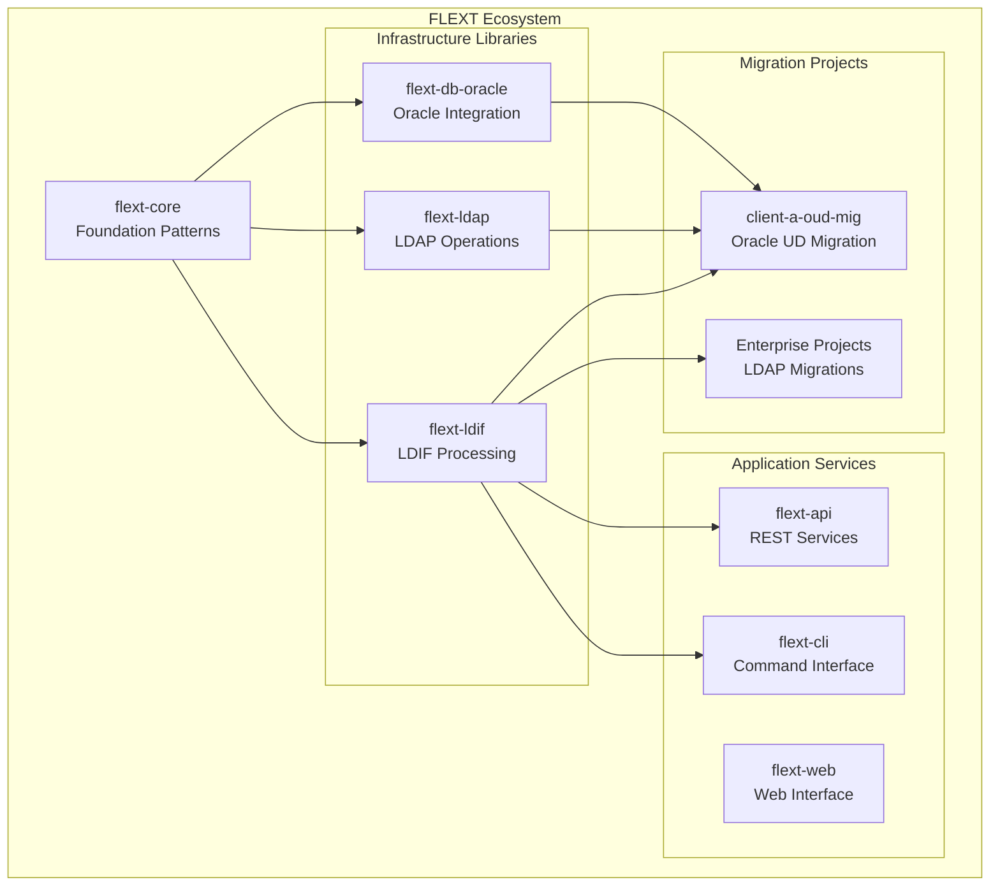

# FLEXT Ecosystem Integration

**Version**: 0.9.0 | **Updated**: September 17, 2025

This document explains how FLEXT-LDIF integrates with the broader FLEXT ecosystem, including patterns for using FLEXT-LDIF within other FLEXT projects and services.

## FLEXT Ecosystem Overview

FLEXT-LDIF is designed as a specialized component within the FLEXT data integration platform, providing LDIF processing capabilities across the ecosystem's 33+ interconnected projects.

### FLEXT-LDIF's Role



## Core Pattern Integration

### FlextResult Railway Programming

FLEXT-LDIF fully implements railway-oriented programming using FlextResult from flext-core:

```python
from flext_core import FlextResult
from flext_ldif import FlextLDIFAPI

def process_directory_export(file_path: str) -> FlextResult[dict]:
    """Process directory export using FLEXT patterns."""
    api = FlextLDIFAPI()

    return (
        # Parse LDIF file
        api.parse_file(file_path)

        # Validate entries (continue with entries on success)
        .flat_map(lambda entries:
            api.validate_entries(entries).map(lambda _: entries))

        # Filter person entries
        .flat_map(api.filter_persons)

        # Generate statistics
        .flat_map(lambda persons:
            api.get_entry_statistics(persons)
            .map(lambda stats: {'persons': persons, 'stats': stats}))

        # Handle errors with context
        .map_error(lambda error: f"Directory processing failed: {error}")
    )
```

### FlextContainer Dependency Injection

Integration with FLEXT's global dependency injection container:

```python
from flext_core import FlextContainer
from flext_ldif import FlextLDIFAPI, FlextLDIFModels

def register_ldif_services() -> FlextResult[None]:
    """Register LDIF services in global container."""
    container = FlextContainer.get_global()

    # Register configuration
    config = FlextLDIFModels.Config(
        max_entries=100000,
        strict_validation=True
    )
    config_result = container.register("ldif_config", config)
    if config_result.is_failure:
        return FlextResult[None].fail(f"Config registration failed: {config_result.error}")

    # Register API instance
    api = FlextLDIFAPI(config=config)
    api_result = container.register("ldif_api", api)
    if api_result.is_failure:
        return FlextResult[None].fail(f"API registration failed: {api_result.error}")

    return FlextResult[None].ok(None)

def get_ldif_api() -> FlextResult[FlextLDIFAPI]:
    """Retrieve LDIF API from container."""
    container = FlextContainer.get_global()
    return container.get("ldif_api")
```

### FlextLogger Integration

Structured logging with FLEXT ecosystem patterns:

```python
from flext_core import FlextLogger
from flext_ldif import FlextLDIFAPI

class LdifProcessingService:
    """Service class demonstrating FLEXT logging integration."""

    def __init__(self) -> None:
        self._logger = FlextLogger(__name__)
        self._ldif_api = FlextLDIFAPI()

    def process_ldif_with_logging(self, file_path: str) -> FlextResult[int]:
        """Process LDIF with comprehensive logging."""
        self._logger.info("Starting LDIF processing", extra={
            'file_path': file_path,
            'service': 'ldif_processing'
        })

        result = self._ldif_api.parse_file(file_path)
        if result.is_success:
            entries = result.unwrap()
            self._logger.info("LDIF processing successful", extra={
                'file_path': file_path,
                'entries_count': len(entries),
                'processing_status': 'success'
            })
            return FlextResult[int].ok(len(entries))
        else:
            self._logger.error("LDIF processing failed", extra={
                'file_path': file_path,
                'error': result.error,
                'processing_status': 'failed'
            })
            return FlextResult[int].fail(f"Processing failed: {result.error}")
```

## Integration with FLEXT Services

### flext-api Integration

Using FLEXT-LDIF within REST API services:

```python
from flext_api import FlextAPIService
from flext_core import FlextResult
from flext_ldif import FlextLDIFAPI

class LdifAPIService(FlextAPIService):
    """REST API service for LDIF processing."""

    def __init__(self) -> None:
        super().__init__()
        self._ldif_api = FlextLDIFAPI()

    def parse_ldif_endpoint(self, file_content: str) -> FlextResult[dict]:
        """API endpoint for LDIF parsing."""
        return (
            self._ldif_api.parse_string(file_content)
            .map(lambda entries: {
                'status': 'success',
                'entry_count': len(entries),
                'entries': [self._serialize_entry(entry) for entry in entries]
            })
            .map_error(lambda error: {
                'status': 'error',
                'message': str(error)
            })
        )

    def _serialize_entry(self, entry) -> dict:
        """Serialize LDIF entry for API response."""
        return {
            'dn': entry.dn,
            'attributes': entry.attributes,
            'object_classes': entry.get_object_classes()
        }
```

### flext-cli Integration

Command-line interface integration patterns:

```python
from flext_cli import FlextCLIService
from flext_core import FlextResult
from flext_ldif import FlextLDIFAPI
from pathlib import Path

class LdifCLIService(FlextCLIService):
    """CLI service for LDIF operations."""

    def __init__(self) -> None:
        super().__init__()
        self._ldif_api = FlextLDIFAPI()

    def parse_command(self, input_file: str, output_format: str = 'json') -> FlextResult[None]:
        """CLI command for parsing LDIF files."""
        file_path = Path(input_file)

        return (
            self._ldif_api.parse_file(file_path)
            .flat_map(lambda entries: self._output_results(entries, output_format))
            .map_error(lambda error: f"CLI parse command failed: {error}")
        )

    def _output_results(self, entries, format_type: str) -> FlextResult[None]:
        """Output parsing results in specified format."""
        if format_type == 'json':
            import json
            output = json.dumps([
                {'dn': entry.dn, 'attributes': entry.attributes}
                for entry in entries
            ], indent=2)
            print(output)
            return FlextResult[None].ok(None)
        elif format_type == 'summary':
            print(f"Parsed {len(entries)} LDIF entries")
            stats_result = self._ldif_api.get_entry_statistics(entries)
            if stats_result.is_success:
                stats = stats_result.unwrap()
                print(f"Object class distribution: {stats}")
            return FlextResult[None].ok(None)
        else:
            return FlextResult[None].fail(f"Unsupported output format: {format_type}")
```

## Migration Project Integration

### client-a Oracle Unified Directory Migration

Integration pattern for enterprise migration projects:

```python
from flext_ldif import FlextLDIFAPI, FlextLDIFModels
from flext_core import FlextResult, FlextLogger
from pathlib import Path

class client-aOUDMigrationService:
    """client-a Oracle Unified Directory migration service."""

    def __init__(self) -> None:
        self._logger = FlextLogger(__name__)

        # Configure for enterprise migration
        migration_config = FlextLDIFModels.Config(
            max_entries=None,  # No limits for enterprise data
            strict_validation=False,  # Accommodate legacy data
            ignore_unknown_attributes=True,  # Handle custom schemas
            encoding='utf-8'
        )

        self._ldif_api = FlextLDIFAPI(config=migration_config)

    def process_oud_export(self, export_file: Path) -> FlextResult[dict]:
        """Process Oracle Unified Directory export."""
        self._logger.info("Starting OUD export processing", extra={
            'export_file': str(export_file),
            'migration_phase': 'ldif_processing'
        })

        return (
            # Parse large enterprise export
            self._ldif_api.parse_file(export_file)

            # Separate users and groups for different processing
            .flat_map(self._categorize_entries)

            # Apply migration-specific transformations
            .flat_map(self._apply_migration_transformations)

            # Generate migration report
            .map(self._generate_migration_report)

            # Log completion
            .map(self._log_migration_completion)
        )

    def _categorize_entries(self, entries) -> FlextResult[dict]:
        """Categorize entries for migration processing."""
        try:
            users = []
            groups = []
            other = []

            for entry in entries:
                if entry.is_person():
                    users.append(entry)
                elif entry.is_group():
                    groups.append(entry)
                else:
                    other.append(entry)

            return FlextResult[dict].ok({
                'users': users,
                'groups': groups,
                'other': other,
                'total': len(entries)
            })
        except Exception as e:
            return FlextResult[dict].fail(f"Entry categorization failed: {e}")

    def _apply_migration_transformations(self, categorized: dict) -> FlextResult[dict]:
        """Apply client-a-specific migration transformations."""
        # Implementation would include client-a-specific business logic
        # for transforming OUD entries for target system

        self._logger.info("Applying migration transformations", extra={
            'user_count': len(categorized['users']),
            'group_count': len(categorized['groups']),
            'other_count': len(categorized['other'])
        })

        # Return transformed data
        return FlextResult[dict].ok(categorized)

    def _generate_migration_report(self, processed_data: dict) -> dict:
        """Generate comprehensive migration report."""
        return {
            'migration_summary': {
                'total_entries': processed_data['total'],
                'users_processed': len(processed_data['users']),
                'groups_processed': len(processed_data['groups']),
                'other_entries': len(processed_data['other'])
            },
            'processing_status': 'completed',
            'data': processed_data
        }

    def _log_migration_completion(self, report: dict) -> dict:
        """Log migration completion."""
        self._logger.info("OUD migration processing completed", extra={
            'migration_summary': report['migration_summary'],
            'migration_phase': 'ldif_processing_complete'
        })
        return report
```

## Database Integration

### Oracle Database Integration (via flext-db-oracle)

```python
from flext_db_oracle import FlextOracleService
from flext_ldif import FlextLDIFAPI
from flext_core import FlextResult

class LdifOracleIntegrationService:
    """Service integrating LDIF processing with Oracle database."""

    def __init__(self) -> None:
        self._ldif_api = FlextLDIFAPI()
        self._oracle_service = FlextOracleService()

    def import_ldif_to_oracle(self, ldif_file: str, table_name: str) -> FlextResult[int]:
        """Import LDIF entries to Oracle database."""
        return (
            # Parse LDIF entries
            self._ldif_api.parse_file(ldif_file)

            # Transform entries to database records
            .map(self._transform_entries_for_db)

            # Insert into Oracle database
            .flat_map(lambda records:
                self._oracle_service.bulk_insert(table_name, records))

            # Return count of inserted records
            .map(lambda result: result['inserted_count'])
        )

    def _transform_entries_for_db(self, entries) -> list[dict]:
        """Transform LDIF entries to database records."""
        records = []
        for entry in entries:
            record = {
                'dn': entry.dn,
                'object_classes': ','.join(entry.get_object_classes()),
                'attributes': json.dumps(entry.attributes),
                'is_person': entry.is_person(),
                'is_group': entry.is_group()
            }
            records.append(record)
        return records
```

## Web Interface Integration

### flext-web Integration

```python
from flext_web import FlextWebService
from flext_ldif import FlextLDIFAPI
from flext_core import FlextResult

class LdifWebService(FlextWebService):
    """Web service for LDIF processing interface."""

    def __init__(self) -> None:
        super().__init__()
        self._ldif_api = FlextLDIFAPI()

    def upload_and_process_ldif(self, uploaded_file) -> FlextResult[dict]:
        """Handle LDIF file upload and processing."""
        try:
            # Read uploaded file content
            file_content = uploaded_file.read().decode('utf-8')

            return (
                # Parse uploaded LDIF
                self._ldif_api.parse_string(file_content)

                # Generate web-friendly response
                .map(self._create_web_response)

                # Handle errors for web display
                .map_error(lambda error: {
                    'status': 'error',
                    'message': f"LDIF processing failed: {error}",
                    'entries': [],
                    'statistics': {}
                })
            )
        except Exception as e:
            return FlextResult[dict].fail(f"File upload processing failed: {e}")

    def _create_web_response(self, entries) -> dict:
        """Create web-friendly response from LDIF entries."""
        # Generate statistics
        stats_result = self._ldif_api.get_entry_statistics(entries)
        statistics = stats_result.unwrap() if stats_result.is_success else {}

        return {
            'status': 'success',
            'entry_count': len(entries),
            'statistics': statistics,
            'entries': [
                {
                    'dn': entry.dn,
                    'object_classes': entry.get_object_classes(),
                    'attribute_count': len(entry.attributes)
                }
                for entry in entries[:100]  # Limit for web display
            ],
            'has_more': len(entries) > 100
        }
```

## Testing Integration

### FLEXT Test Patterns

Integration with FLEXT ecosystem testing patterns:

```python
from flext_tests import FlextTestBase, FlextFixtures
from flext_ldif import FlextLDIFAPI
from flext_core import FlextResult

class TestLdifIntegration(FlextTestBase):
    """Test LDIF integration with FLEXT patterns."""

    def setup_method(self) -> None:
        """Setup test environment."""
        super().setup_method()
        self.ldif_api = FlextLDIFAPI()
        self.test_ldif = FlextFixtures.get_sample_ldif()

    def test_ldif_with_container_integration(self) -> None:
        """Test LDIF API integration with FlextContainer."""
        # Register API in container
        registration_result = self.container.register("ldif_api", self.ldif_api)
        assert registration_result.is_success

        # Retrieve and use API from container
        api_result = self.container.get("ldif_api")
        assert api_result.is_success

        api = api_result.unwrap()
        parse_result = api.parse_string(self.test_ldif)
        assert parse_result.is_success

    def test_ldif_railway_programming(self) -> None:
        """Test LDIF operations with railway programming patterns."""
        result = (
            self.ldif_api.parse_string(self.test_ldif)
            .flat_map(self.ldif_api.validate_entries)
            .flat_map(lambda entries: self.ldif_api.filter_persons(entries))
            .flat_map(lambda persons: self.ldif_api.get_entry_statistics(persons))
        )

        assert result.is_success
        stats = result.unwrap()
        assert isinstance(stats, dict)
```

## Best Practices for Integration

### 1. Use FLEXT Patterns Consistently

Always use FlextResult for error handling and FlextContainer for dependency injection:

```python
# ✅ Good: Consistent FLEXT patterns
def integrate_ldif_service() -> FlextResult[FlextLDIFAPI]:
    container = FlextContainer.get_global()
    config_result = container.get("ldif_config")

    if config_result.is_success:
        config = config_result.unwrap()
        api = FlextLDIFAPI(config=config)
        return FlextResult[FlextLDIFAPI].ok(api)
    else:
        return FlextResult[FlextLDIFAPI].fail("Configuration not available")

# ❌ Avoid: Mixing error handling patterns
def bad_integration():
    try:
        container = FlextContainer.get_global()
        config = container.get("ldif_config").unwrap()  # Could raise exception
        return FlextLDIFAPI(config=config)
    except Exception as e:
        print(f"Error: {e}")  # Inconsistent with FLEXT patterns
        return None
```

### 2. Register Services in Container

Register LDIF services in the global container for ecosystem-wide access:

```python
def bootstrap_application() -> FlextResult[None]:
    """Bootstrap application with LDIF services."""
    container = FlextContainer.get_global()

    # Register configuration
    config = FlextLDIFModels.Config(max_entries=100000)
    config_registration = container.register("ldif_config", config)

    # Register API
    api = FlextLDIFAPI(config=config)
    api_registration = container.register("ldif_api", api)

    # Verify all registrations succeeded
    if config_registration.is_success and api_registration.is_success:
        return FlextResult[None].ok(None)
    else:
        return FlextResult[None].fail("Service registration failed")
```

### 3. Use Structured Logging

Integrate with FLEXT logging patterns for observability:

```python
def process_with_observability(file_path: str) -> FlextResult[dict]:
    """Process LDIF with comprehensive observability."""
    logger = FlextLogger(__name__)
    ldif_api = FlextLDIFAPI()

    # Log operation start
    logger.info("LDIF processing started", extra={
        'operation': 'ldif_processing',
        'file_path': file_path,
        'component': 'flext-ldif'
    })

    result = ldif_api.parse_file(file_path)

    if result.is_success:
        entries = result.unwrap()
        logger.info("LDIF processing completed", extra={
            'operation': 'ldif_processing',
            'file_path': file_path,
            'entries_processed': len(entries),
            'status': 'success',
            'component': 'flext-ldif'
        })
        return FlextResult[dict].ok({'entries': len(entries)})
    else:
        logger.error("LDIF processing failed", extra={
            'operation': 'ldif_processing',
            'file_path': file_path,
            'error': result.error,
            'status': 'failed',
            'component': 'flext-ldif'
        })
        return FlextResult[dict].fail(result.error)
```

---

This integration guide demonstrates how FLEXT-LDIF seamlessly integrates with the broader FLEXT ecosystem while maintaining consistent patterns and professional software architecture principles.